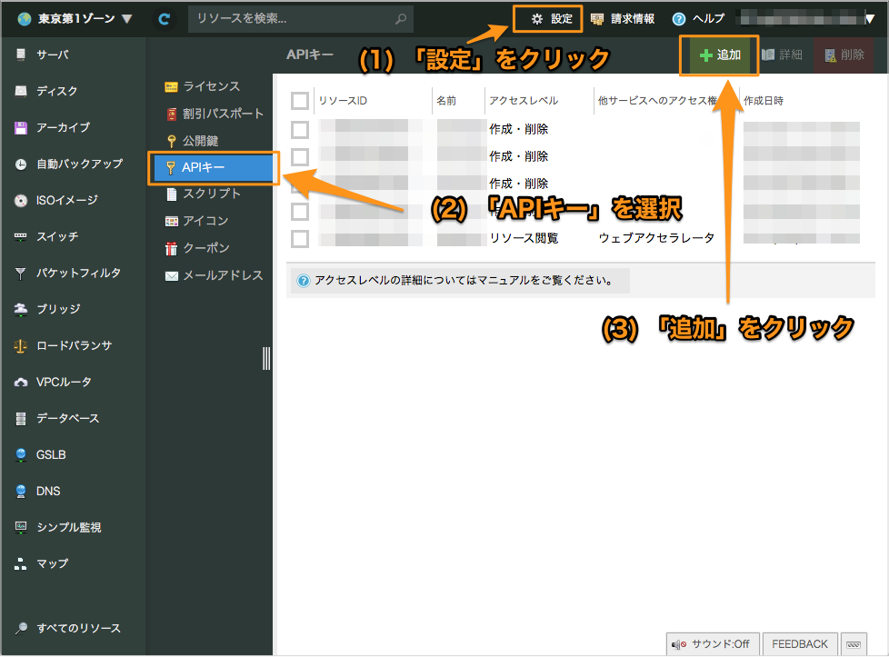
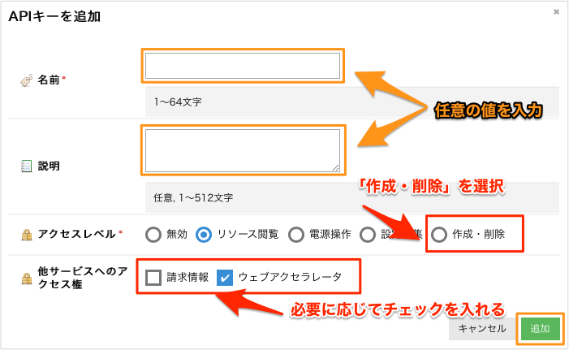
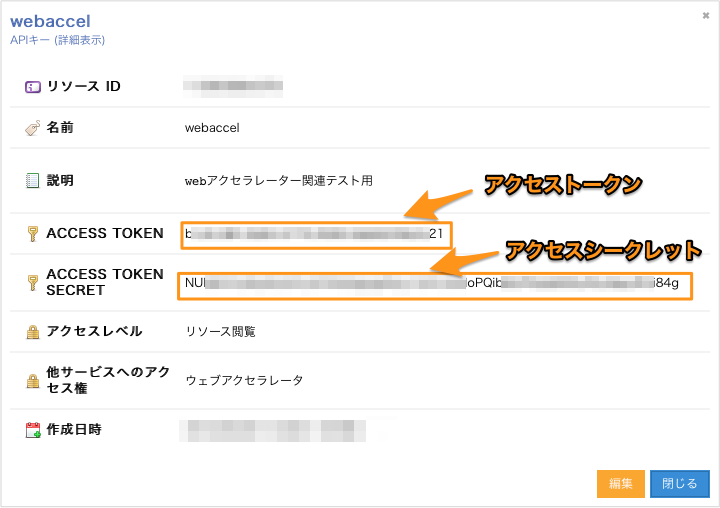

# Usacloud導入ガイド

---

# 目次

  * [usacloudとは](#usacloud_1)
  * [インストール](#_2)
  * [設定](#_3)

---

# usacloudとは 

`usacloud`とは、さくらのクラウド用のCLIクライアントです。  

以下のOS/Archに対応しています。

  - macOS(amd64)
  - Linux(i386/amd64/arm)
  - Windows(i386/amd64)

---

# インストール

### macOS(`homebrew`) / Linux(`linuxbrew`)

```bash
brew tap sacloud/usacloud; brew install usacloud
```

> ※bash_completionを有効化するには上記コマンドを実行後に再ログインしてください。

--- 

### RHEL / CentOS

```bash
curl -fsSL https://releases.usacloud.jp/usacloud/repos/setup-yum.sh | sh
```

> ※bash_completionを有効化するには上記コマンドを実行後に再ログインしてください。

--- 

### Ubuntu / debian / bash on Windows

```bash
curl -fsSL https://releases.usacloud.jp/usacloud/repos/setup-apt.sh | sh
```

> ※bash_completionを有効化するには上記コマンドを実行後に再ログインしてください。

---

### Windows(`chocolatey`)

    choco install usacloud

> chocolateyの[usacloudパッケージ](https://chocolatey.org/packages/usacloud)は @223n さんによってメンテナンスされています。

---

### Windows/その他の場合

以下のリンクからバイナリーファイルをダウンロードして展開し、任意のフォルダー内に配置してください。  
(PATHを通しておくと便利です)

- Windows 64bit版 : [https://releases.usacloud.jp/usacloud/repos/windows/usacloud_windows-amd64.zip](https://releases.usacloud.jp/usacloud/repos/windows/usacloud_windows-amd64.zip)
- Windows 32bit版 : [https://releases.usacloud.jp/usacloud/repos/windows/usacloud_windows-386.zip](https://releases.usacloud.jp/usacloud/repos/windows/usacloud_windows-386.zip)
- その他の場合 : [https://github.com/sacloud/usacloud/releases/latest/](https://github.com/sacloud/usacloud/releases/latest/)

`bash_completion`が利用できる場合は、以下のコマンドで`usacloud`用の`bash_completion`を導入することが出来ます。

```bash
curl -s -L https://releases.usacloud.jp/usacloud/contrib/completion/bash/usacloud >> ~/.bashrc
```

> ※bash_completionを有効化するには上記コマンドを実行後に再ログインしてください。

---

### Dockerを利用する場合

`usacloud`実行用イメージとして`sacloud/usacloud`を公開しています。

```bash
# Dockerでのusacloud実行例
docker run -it --rm \
    -e SAKURACLOUD_ACCESS_TOKEN \
    -e SAKURACLOUD_ACCESS_TOKEN_SECRET \
    -e SAKURACLOUD_ZONE \
    sacloud/usacloud server ls
```

---

### whalebrewを利用する場合


Dockerイメージ`sacloud/usacloud`は`whalebrew`でのインストール/実行に対応しています。

```bash
# インストール
whalebrew install sacloud/usacloud
```

---

# 設定

`usacloud`の実行にはさくらのクラウドのAPIキーの取得/設定が必要です。

## APIキーの取得

[さくらのクラウドのコントロールパネル](https://secure.sakura.ad.jp/cloud/)からAPIキーを発行します。

コントロールパネルにログインし、「さくらのクラウド(IaaS)」を選択します。


次に以下手順でAPIキーの追加画面を表示します。

  - (1) 画面右上の「設定」をクリック
  - (2) 左側に表示されるメニューから「APIキー」を選択
  - (3) 一覧の右上の「追加」をクリック



APIキーの追加画面が表示されたら、各項目を入力して「追加」をクリックします。

各項目は以下のように入力してください。

  - 名前 : 任意の名前を入力
  - 説明 : 任意入力
  - アクセスレベル : `作成・削除`を選択
  - 他サービスへのアクセス権 : 必要に応じてチェックを入れる



APIキーを作成したら、以下の値を控えておいてください。

  - アクセストークン
  - アクセスシークレット



以上でAPIキーの取得完了です。

---

## APIキーの設定

APIキーの取得を行ったら、`usacloud config`を実行してAPIキーを設定します。

画面の指示に従い、アクセストークン(token)とシークレット(secret)、操作対象のゾーン、デフォルトの出力形式の入力を行います。

```bash
usacloud config

  Setting SakuraCloud API Token => 
  	Enter token: [アクセストークンを入力]

  Setting SakuraCloud API Secret => 
  	Enter secret: [アクセスシークレットを入力]
    	
  Setting SakuraCloud Zone => 
  	Enter zone[is1a/is1b/tk1a/tk1v](default:tk1a): [ゾーンを入力]
  
  Setting Default Output Type => 
	Enter default-output-type[table/json/csv/tsv]: [デフォルトの出力形式を入力]
	
  Written your settings to ~/.usacloud/default/config.json
```

操作対象のゾーンは以下のいずれかを入力してください。

  * `is1a` : 石狩第1ゾーン
  * `is1b` : 石狩第2ゾーン
  * `tk1a` : 東京第1ゾーン
  * `tk1v` : サンドボックス
  
> ※`is1a`は2016年7月1日以降に新規作成したアカウントでは[利用できません](http://cloud-news.sakura.ad.jp/2016/07/01/restric_account_is1a/)  
> ※ここで入力した内容は`~/.usacloud/default/config.json`にJSONファイルとして保存されます


### その他のAPIキー設定方法

APIキーは環境変数で指定することも可能です。

```bash
export SAKURACLOUD_ACCESS_TOKEN=アクセストークン
export SAKURACLOUD_ACCESS_TOKEN_SECRET=アクセスシークレット
export SAKURACLOUD_ZONE=ゾーン
```

また、コマンド実行の都度指定することも可能です。

```bash
usacloud --token=アクセストークン --secret=アクセスシークレット --zone=ゾーン server ls
```

複数の箇所で指定されていた場合、以下の順で読み込みます(後から読み込んだものが優先)。

1. 環境変数での設定
2. `usacloud config`での設定
3. コマンド実行時の指定

--- 

以上で設定終了です。続いて[基本的な使い方](basic_usage.md)に進んでください。
